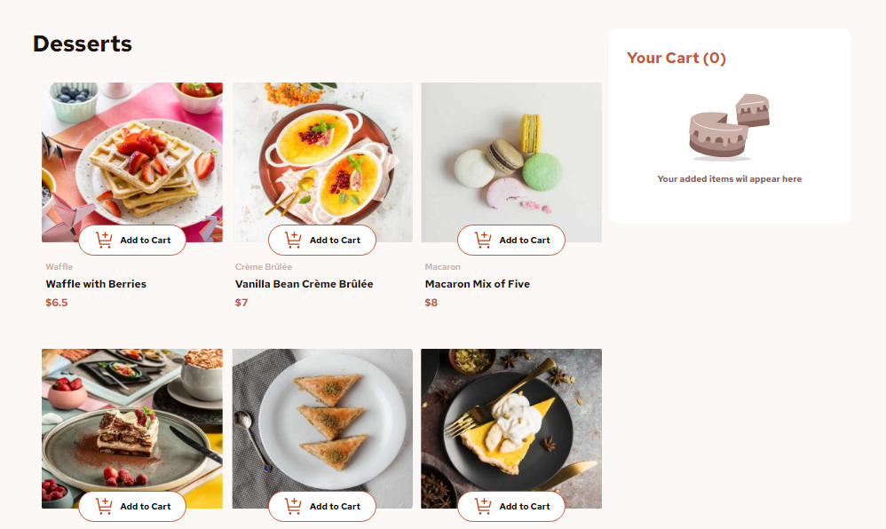
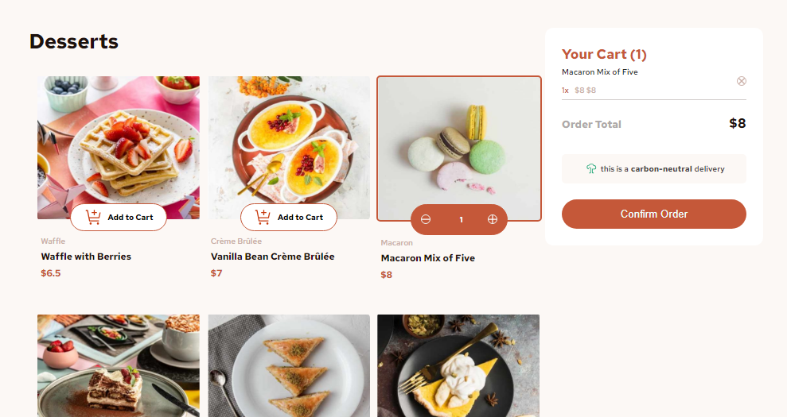
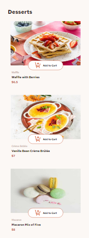
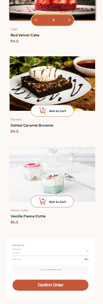

# Frontend Mentor - Product list with cart solution

This is a solution to the [Product list with cart challenge on Frontend Mentor](https://www.frontendmentor.io/challenges/product-list-with-cart-5MmqLVAp_d). Frontend Mentor challenges help you improve your coding skills by building realistic projects. 

## Table of contents

- [Overview](#overview)
  - [The challenge](#the-challenge)
  - [Screenshot](#screenshot)
  - [Links](#links)
  - [Built with](#built-with)
  - [What I learned](#what-i-learned)
  - [Continued development](#continued-development)
- [Author](#author)

## Overview

A resposive product list with a dynamic cart. using HTML, CSS and JavaScript, this repo provides a code that will display a product list based on the data comming from a json file. you ineract with the cards and add the product you want to the cart or even remove it from it. after seeming comfortable with the cart go ahead and pay. you can start a new order and choose again.

### The challenge

Users should be able to:

- Add items to the cart and remove them
- Increase/decrease the number of items in the cart
- See an order confirmation modal when they click "Confirm Order"
- Reset their selections when they click "Start New Order"
- View the optimal layout for the interface depending on their device's screen size
- See hover and focus states for all interactive elements on the page

### Screenshot

Desktop Version





Mobile Version





### Links

- Solution URL: [the repo](https://github.com/Eman288/Responsive-Product-List-with-Dynamic-Cart)
- Live Site URL: [Test it yourself]([https://your-live-site-url.com](https://eman288.github.io/Responsive-Product-List-with-Dynamic-Cart/))


### Built with

- Semantic HTML5 markup
- CSS custom properties
- Flexbox
- Mobile-first workflow
- JavaScript

### What I learned

one of the best things i learned in this project is how to deal with the json files and get the data from it to automatically create the card objects without the need to statically set them in the html code 


```js
let jsonData = [];  // Initialize jsonData as an empty array

fetch('../data.json')
.then(response => response.json())
.then(data => {
    jsonData = data;  // Assign the fetched data to jsonData
    // Call the function to create cards after the data is loaded
    window.onload = function() {
        jsonData.forEach((element, index) => {
            createCard(index + 1, element.category, element.name, element.price, element.image.desktop);
        });
    };
})
.catch(error => {
    console.error('Error loading JSON:', error);
});
```

### Continued development

the way i use to get the data from the json file and create the cards

## Author

- LinkedIn - [Eman Tamam](https://www.linkedin.com/in/eman-tamam-47a2a9241/)
- Frontend Mentor - [@Eman288](https://www.frontendmentor.io/profile/Eman288)
